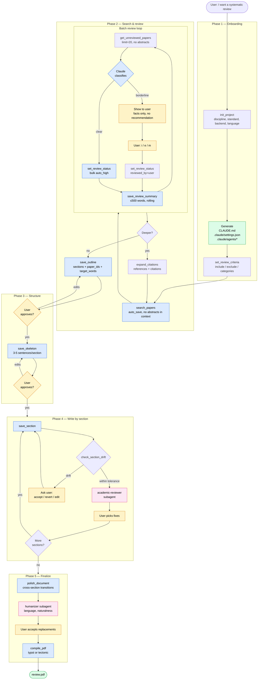

# snowcite

MCP server for systematic literature review. Search arXiv / Semantic Scholar / OpenAlex / Crossref / PubMed, snowball through citations, review papers through chat, generate Typst or LaTeX documents, compile to PDF.

> No web UI, no browser, no second terminal. Claude reads abstracts in batches, pre-filters autonomously, surfaces borderline cases to you in chat.

## How it works



**Legend** — 🟨 user decisions, 🟦 automatic MCP calls, 🟪 subagents (fresh-context review), 🟩 outputs.

## Install

```bash
# Register as an MCP server in Claude Code
claude mcp add snowcite -- uvx snowcite

# Optional but recommended — API keys boost rate limits
claude mcp add snowcite \
  -e SNOWCITE_SEMANTIC_SCHOLAR_API_KEY=xxx \
  -e SNOWCITE_OPENALEX_EMAIL=you@example.com \
  -- uvx snowcite

# Compile backends (install at least one)
brew install typst     # recommended — Cyrillic works out of the box
brew install tectonic  # LaTeX fallback
```

## First run

```
> init_project() here, I'm writing a bachelor thesis on X in Russian, ГОСТ 7.32
```

Claude collects metadata (author, institution, discipline, standard, backend),
scaffolds `.snowcite/` in the current directory, generates a tailored `CLAUDE.md`,
and creates review subagents under `.claude/agents/`.

Then drive the workflow from chat — set criteria, search, review, snowball,
outline, write, compile. See the diagram above for the full picture.

## Projects live in directories

Like `.git`, a `.snowcite/` subdirectory marks a project. Work on multiple
reviews in parallel by `cd`-ing between them — no global state, no switching
commands. `git clone` moves a project to a new machine.

```
my-thesis/
├── .snowcite/
│   ├── papers.db         # project DB — metadata, papers, artifacts, outline
│   └── cache/            # compile artifacts, always gitignored
├── CLAUDE.md             # snowcite-managed, regenerated by init_project
├── review.typ            # or review.tex
├── references.yml        # or references.bib
└── ...
```

## Docs

Full documentation: [cop1cat.github.io/snowcite](https://cop1cat.github.io/snowcite/). Coverage:

- Installation on macOS / Linux / Windows
- Workflow in depth (review loop, snowball, draft-first writing, subagents)
- Backends — Typst vs LaTeX, when to pick which
- Standards — ГОСТ 7.32, IEEE / ACM, APA, Vancouver, MLA, Chicago
- Troubleshooting — Cyrillic fonts, `biber` vs `bibtex` in tectonic, safety refusals
- Reference — every MCP tool's signature

## Development

```bash
git clone https://github.com/cop1cat/snowcite.git
cd snowcite
uv sync --group dev
uv run pytest
uv run ruff check
uv run ruff format
```

CI runs ruff + pytest on every push and PR.

## What this isn't

- **Not a web UI.** Review happens in chat. Architectural choice, see `CLAUDE.md`.
- **Not a Zotero replacement.** We import BibTeX / RIS but don't integrate with Zotero's API.
- **Not a full-auto thesis generator.** Systematic review requires human judgment at
  criteria-setting, borderline papers, outline structure. snowcite automates the
  mechanical parts and keeps you in the loop for the rest.

## License

MIT — see `LICENSE`.
