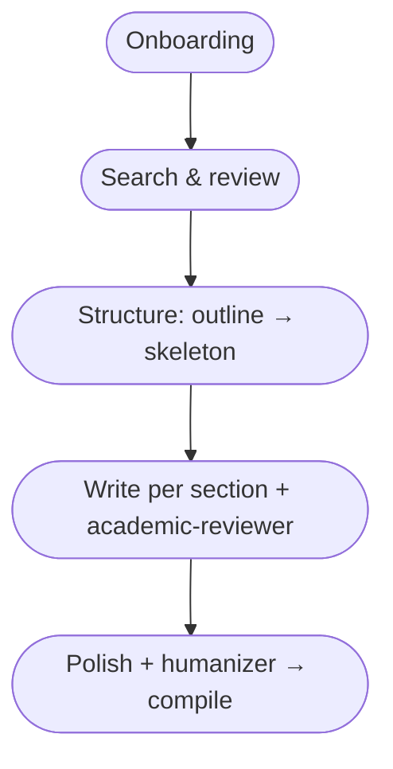

# Workflow

snowcite is five phases. Each phase persists state to the project DB, so
`/clear` or a new session doesn't lose work — `get_session_state()` returns a
snapshot telling Claude where it left off.

## Phase 1 — Onboarding

One MCP call: `init_project(metadata=...)`. See [Getting started](getting-started.md).

Re-run with `update=True` when metadata changes mid-project. Re-run with
`update_agents=True` to pull the latest subagent prompts without losing your
project state.

## Phase 2 — Search and review

Every new project starts with `set_review_criteria`. Before each review batch,
Claude calls `get_review_criteria()` as a drift guard (criteria drift is
common when reviews span weeks).

### Search

`search_papers(query, sources=None, limit=20, auto_save=True, abstract_max_chars=0)`

- `sources=None` → automatic routing based on your discipline metadata. STEM
  (cs, physics, math) includes arXiv; medicine/biology includes PubMed;
  everyone gets OpenAlex + Semantic Scholar + Crossref.
- `auto_save=True` → results go straight into the DB. The response is
  `{saved, duplicates, new_ids, titles}` — no abstract bodies in the chat.

### Review batches

`get_unreviewed_papers(limit=20, include_abstracts=False)` returns compact
metadata (title, year, venue, authors) — enough for clear-cut classifications
without leaking harmful-sounding abstracts into the context (which accumulates
and can trigger safety refusals on sensitive topics like adversarial ML).

For each paper Claude decides:

- **Clear match** → batch `set_review_status([...], "approved", reviewed_by="auto_high")`
- **Clear miss** → batch `set_review_status([...], "rejected", reviewed_by="auto_high")`
- **Likely but uncertain** → decide with `reviewed_by="auto_low"` — the user can
  later pass over just these via `get_low_confidence_reviews()`
- **Genuinely borderline** → defer. For borderline papers, fetch the full
  abstract via `get_paper_details(paper_id)`, summarize in 1-2 neutral
  sentences, and show to the user. Do **not** recommend a decision — that
  creates bias.

After each batch, `save_review_summary(summary, clusters)` updates the rolling
≤500-word summary.

### Snowball

`expand_citations(paper_id, "references" | "citations")` walks the citation
graph of an approved paper. Uses Semantic Scholar as the graph source; for
arXiv-only papers without a DOI, the call falls back to DOI lookup. New papers
auto-save to `unreviewed`; the summary is marked stale.

## Phase 3 — Structure

`save_outline(sections=[{"name", "target_words", "paper_ids": [...]}, ...])`,
then `approve_outline()` after the user OKs it.

`save_skeleton(sections=[{"name", "draft"}, ...])` — 3-5 sentences per section.
This gives you the document arc in ~500 words total. Approve via
`approve_skeleton()`.

Approval is semantic, not enforced: tools keep working if you skip it, but the
workflow's quality guarantees (drift checks against the approved outline,
subagent context) assume it.

## Phase 4 — Section by section

For each outline entry:

1. Claude drafts the section based on the skeleton, assigned paper abstracts,
   and any previously expanded sections.
2. `check_section_drift(name, content)` — returns warnings if the word count
   exceeds `max(100, ±30%)` of target, or paper IDs have diverged from the
   outline. Claude surfaces these to the user before saving.
3. `save_section(name, content)` persists with a version counter.
4. Claude spawns the `academic-reviewer` subagent via the Agent tool. It calls
   `prepare_section_for_review(name)` and returns a structured findings list.
5. User picks fixes; Claude applies them via another `save_section`.

## Phase 5 — Finalize

`polish_document([...])` — Claude rewrites to fix cross-section transitions,
consistent terminology across sections, and removes duplicate tezises. This
is structural, not stylistic.

Then spawn the `humanizer` subagent. It flags language issues (machine-translated
phrasing, LLM tics, awkward word choice) and proposes per-phrase replacements.
User accepts; `polish_section(name, polished_content)` persists with `polished=1`.

Finally `compile_pdf(doc_path)`. Backend is inferred from the extension:

- `.typ` → `typst compile`
- `.tex` → `tectonic`

## Session recovery

After `/clear` or in a new session, Claude calls `get_session_state()` first.
It returns the current phase (`reviewing` / `writing` / etc.) and a `next_action`
hint, so Claude can resume without re-probing the DB.
