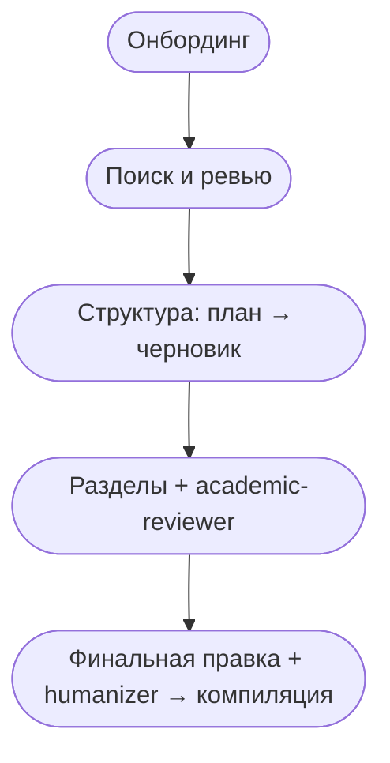

# Workflow

Работа со snowcite состоит из пяти фаз. Состояние каждой фазы сохраняется
в базе проекта, поэтому `/clear` или перезапуск сессии не приводят
к потере прогресса: `get_session_state()` возвращает снимок, позволяющий
восстановить контекст.



## Фаза 1. Онбординг

Один вызов — `init_project(metadata=...)`. Подробнее см. раздел
[Начало работы](getting-started.md).

Повторный запуск с `update=True` обновляет метаданные без потери данных
проекта. Флаг `update_agents=True` обновляет промпты субагентов из
актуального шаблона.

## Фаза 2. Поиск и ревью

Каждый новый проект начинается с `set_review_criteria`. Перед каждым
батчем Claude вызывает `get_review_criteria()` — это защита от
расхождения между текущим ходом ревью и изначально заданными
критериями (критерии могут быть заданы задолго до возобновления работы).

### Поиск

```
search_papers(query, sources=None, limit=20, auto_save=True, abstract_max_chars=0)
```

- `sources=None` — автоматический выбор источников на основе дисциплины
  из `project_metadata`. Для STEM-областей (`cs`, `physics`, `math`)
  подключается arXiv; для медицины и биологии — PubMed; Semantic
  Scholar, OpenAlex и Crossref используются во всех случаях.
- `auto_save=True` — результаты записываются в базу напрямую. Ответ
  содержит только сводку `{saved, duplicates, new_ids, titles}` без
  текстов абстрактов.

### Батчи ревью

`get_unreviewed_papers(limit=20, include_abstracts=False)` возвращает
компактные записи (название, год, venue, авторы). Этого достаточно
для очевидных классификаций, и при этом в контекст чата не попадают
потенциально чувствительные термины из абстрактов — иначе при
накоплении они могут приводить к ложным срабатываниям safety-классификатора.

Для каждой работы Claude принимает одно из решений:

- **явное совпадение** — `set_review_status([...], "approved", reviewed_by="auto_high")`;
- **явно нерелевантно** — `set_review_status([...], "rejected", reviewed_by="auto_high")`;
- **вероятно, но без полной уверенности** — решение принимается с
  `reviewed_by="auto_low"`, и в дальнейшем вы можете пройтись только
  по таким записям через `get_low_confidence_reviews()`;
- **неоднозначный случай** — откладывается на ваше решение. Для таких
  работ Claude запрашивает полный абстракт через `get_paper_details(paper_id)`
  и приводит нейтральный пересказ в одно-два предложения. Рекомендаций
  «включить» или «исключить» не выдаёт, чтобы не смещать оценку.

После каждого батча `save_review_summary(summary, clusters)` обновляет
rolling summary объёмом до 500 слов.

### Snowball

`expand_citations(paper_id, "references" | "citations")` обходит граф
цитирований одобренной работы. Основной источник — Semantic Scholar;
для работ из arXiv без DOI выполняется дополнительный lookup по DOI.
Новые работы попадают в `unreviewed`, сводка помечается устаревшей.

## Фаза 3. Структура

`save_outline(sections=[{"name", "target_words", "paper_ids": [...]}, ...])`,
затем `approve_outline()` после согласования.

`save_skeleton(sections=[{"name", "draft"}, ...])` — 3–5 предложений
на раздел. Это позволяет увидеть общую арку документа в объёме
порядка 500 слов. Утверждается через `approve_skeleton()`.

Утверждение имеет семантический, а не технический характер: инструменты
продолжат работать и без него, но гарантии качества (drift-check по
одобренному плану, контекст для субагентов) рассчитывают на одобренные
план и черновик.

## Фаза 4. Разделы

Для каждого элемента плана:

1. Claude пишет раздел, опираясь на черновик, абстракты назначенных
   работ и уже написанные разделы.
2. `check_section_drift(name, content)` возвращает предупреждения,
   если объём выходит за `max(100, ±30%)` от целевого или если
   набор paper_ids не соответствует плану. Claude показывает их
   пользователю до сохранения.
3. `save_section(name, content)` сохраняет текст с версионированием.
4. Через Agent tool запускается субагент `academic-reviewer`. Он
   вызывает `prepare_section_for_review(name)` и возвращает
   структурированный список замечаний.
5. Пользователь выбирает, какие замечания учитывать; Claude применяет
   правки через очередной `save_section`.

## Фаза 5. Финальная правка

`polish_document([...])` переписывает документ для согласования
переходов между разделами, унификации терминов и устранения повторов
в тезисах. Это структурная правка, не стилистическая.

Затем через Agent tool запускается субагент `humanizer`. Он помечает
языковые проблемы (кальки, стандартные обороты LLM, неудачный подбор
слов) и предлагает замены на уровне отдельных фраз. Принятые правки
сохраняются через `polish_section(name, polished_content)` с
установкой `polished=1`.

Наконец, `compile_pdf(doc_path)`. Бэкенд определяется по расширению:

- `.typ` → `typst compile`
- `.tex` → `tectonic`

## Восстановление сессии

После `/clear` или в новой сессии Claude первым делом вызывает
`get_session_state()`. Ответ содержит текущую фазу (`reviewing`,
`writing` и т. п.) и подсказку `next_action`, позволяющую продолжить
работу без повторного опроса базы.
